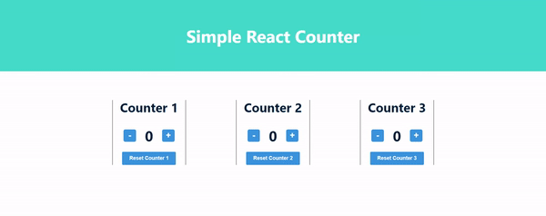

# Simple React Counter

<div style="display:flex;justify-content:center;width:100%;">
  
</div>
<br>

This is a simple react project to demonstrate my knowledge in handling events, working with props/state, and applying the concept of [lifting the state](https://reactjs.org/docs/lifting-state-up.html). I have also styled the page with [CSS modules](https://github.com/css-modules/css-modules) and added tests with [React Testing Library](https://testing-library.com/docs/react-testing-library/intro/). If you would like to learn more about how I built this, feel free to skip to the ['Purpose Of This Project' section](#purpose-of-this-project)

## Table Of Contents
- [Simple React Counter](#simple-react-counter)
  - [Table Of Contents](#table-of-contents)
  - [Live Demo](#live-demo)
  - [Setup](#setup)
  - [Notable Features](#notable-features)
    - [Decrement and Reset Button Are Disabled When State is 0](#decrement-and-reset-button-are-disabled-when-state-is-0)
    - [<App> only depends on 3 functions for click event](#app-only-depends-on-3-functions-for-click-event)
    - [Added data-testid to complete unit testing](#added-data-testid-to-complete-unit-testing)
  - [Requirements](#requirements)
  - [Purpose Of This Project](#purpose-of-this-project)
  - [Testing](#testing)
  - [Available Scripts](#available-scripts)
    - [`npm start`](#npm-start)
    - [`npm run test`](#npm-run-test)
    - [`npm run build` or `npm run predeloy`](#npm-run-build-or-npm-run-predeloy)
    - [`npm run deploy`](#npm-run-deploy)
    - [`npm run eject`](#npm-run-eject)
  - [Technologies Used](#technologies-used)

## Live Demo

**[Live Demo of Simple React Counter on GitHub Pages](https://abuna1985.github.io/simple-react-counter/<h4>)**

## Setup

Change directories (cd) to this repo within your terminal and run the following commands:

```shell
npm install
npm start
```

The browser should open at `http://localhost:3000`

## Notable Features

### Decrement and Reset Button Are Disabled When State is 0

### <App> only depends on 3 functions for click event

### Added data-testid to complete unit testing

## Requirements

[x] Apply `props` in the components to make them more customizable

[x] Apply `useState` to 3 separate counters

[x] Use a organized structure for `components` in the react application

[x] Have 3 separate counters that work independently of each other

[x] Use the concept of lifting state to keep most of the logic in the <App> component

[x] Write 5-6 unit tests with `react-testing-library` that show the functionality is successful

[x] Incorporate CSS modules in the react application


## Purpose Of This Project

I completed the reading and exercise for [Part 1 of the Full Stack Open Course](https://fullstackopen.com/en/part1). Unfortunately, I did not feel I fully confident in applying these skills in a practical scenario.  So I decided to do 2 things: 

1. Take notes that are a helpful reference if I need a quick refresher. [The notes for part 1 can be found here](https://github.com/abuna1985/full-stack-open-course/tree/main/notes). 
2. Build a project with the knowledge gained and best-practices applied.

I saw the example in part 1D:

```js
const History = (props) => {
  if (props.allClicks.length === 0) {
    return (
      <div>
        the app is used by pressing the buttons
      </div>
    )
  }

  return (
    <div>
      button press history: {props.allClicks.join(' ')}
    </div>
  )
}

const Button = ({ onClick, text }) => (  <button onClick={onClick}>    {text}  </button>)
const App = () => {
  const [left, setLeft] = useState(0)
  const [right, setRight] = useState(0)
  const [allClicks, setAll] = useState([])

  const handleLeftClick = () => {
    setAll(allClicks.concat('L'))
    setLeft(left + 1)
  }

  const handleRightClick = () => {
    setAll(allClicks.concat('R'))
    setRight(right + 1)
  }

  return (
    <div>
      {left}
      <Button onClick={handleLeftClick} text='left' />      <Button onClick={handleRightClick} text='right' />      {right}
      <History allClicks={allClicks} />
    </div>
  )
}
```

And this example in same section:

```js
// This is the right place to define a component
const Button = (props) => (
  <button onClick={props.handleClick}>
    {props.text}
  </button>
)

const App = () => {
  const [value, setValue] = useState(10)

  const setToValue = newValue => {
    setValue(newValue)
  }

  // Do not define components inside another component
  const Display = props => <div>{props.value}</div>
  return (
    <div>
      <Display value={value} />
      <Button handleClick={() => setToValue(1000)} text="thousand" />
      <Button handleClick={() => setToValue(0)} text="reset" />
      <Button handleClick={() => setToValue(value + 1)} text="increment" />
    </div>
  )
}
```

I realized I could build on these examples and create an application with 3 separate counters within the `<App>` state. I would use `props` to customize the `<Title>`, `<Button>`, and `<Display>` components. I would use state hooks to update the 3 counters separately. And all the state and function logic would remain in the <App> component and the other components would be given data and rendered without worrying about where the count is.

In addition, I wanted to challenge myself just a bit more. So I included unit testing with `React Testing Library` and scoped styling with CSS modules. 

## Testing

## Available Scripts

In the project directory, you can run:

### `npm start`

Runs the app in the development mode.\
Open [http://localhost:3000](http://localhost:3000) to view it in the browser.

The page will reload if you make edits.\
You will also see any lint errors in the console.

### `npm run test`

Launches the test runner in the interactive watch mode.\
See the section about [running tests](https://facebook.github.io/create-react-app/docs/running-tests) for more information.

### `npm run build` or `npm run predeloy`

Builds the app for production to the `build` folder.\
It correctly bundles React in production mode and optimizes the build for the best performance.

The build is minified and the filenames include the hashes.\
Your app is ready to be deployed!

See the section about [deployment](https://facebook.github.io/create-react-app/docs/deployment) for more information.

### `npm run deploy`

Your repo will activate GitHub pages for the repo, create a `gh-pages`, and point the GitHub Pages to the `gh-pages` branch. It will then build an app for production and dump the production files/folders into the `gh-pages` branch.

***Note**: If you fork this repo and wish to run this command, please change the `homepage` property within `package.json` to fit your Github Pages link. It will be something like `https://{username}.github.io/simple-react-counter`.

### `npm run eject`

**Note: this is a one-way operation. Once you `eject`, you can’t go back!**

If you aren’t satisfied with the build tool and configuration choices, you can `eject` at any time. This command will remove the single build dependency from your project.

Instead, it will copy all the configuration files and the transitive dependencies (webpack, Babel, ESLint, etc) right into your project so you have full control over them. All of the commands except `eject` will still work, but they will point to the copied scripts so you can tweak them. At this point you’re on your own.

You don’t have to ever use `eject`. The curated feature set is suitable for small and middle deployments, and you shouldn’t feel obligated to use this feature. However we understand that this tool wouldn’t be useful if you couldn’t customize it when you are ready for it.

## Technologies Used

This project was created with:

- [Create React App](https://create-react-app.dev/docs/getting-started)
- [React Testing Library (included with create-react-app)](https://testing-library.com/docs/react-testing-library/intro/)
- [CSS modules]()
- [gh-pages]()


